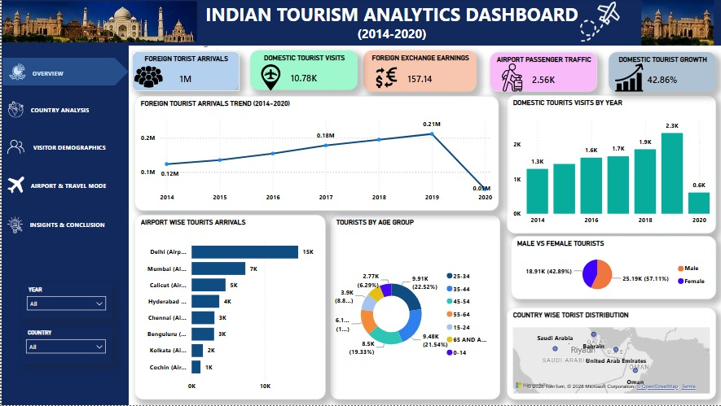
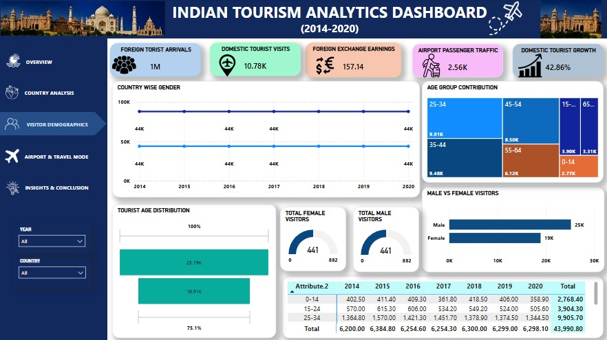
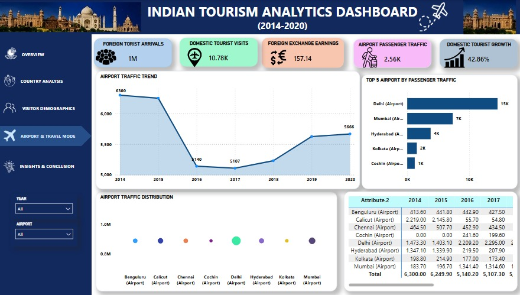

# 🇮🇳 Indian Tourism Data Analytics Dashboard (2014-2020)

An end-to-end Data Analytics project analyzing foreign and domestic tourism trends in India from 2014 to 2020 using **Python, SQL, and Power BI**.

---

## 📸 Dashboard Preview

### 1. Overview Page

### 2. Country Analysis

### 3. Visitor Demographics

### 4. Airport & Travel Mode

### 5. Key Insights & Conclusion

---

## 📌 Project Overview
This project provides an in-depth analysis of Indian Tourism trends, foreign tourist arrivals (FTA), domestic visitor growth, age and gender demographics, primary airport gateways, and foreign exchange earnings.

---

## 🛠️ Tech Stack & Tools Used
* **Data Processing & Preprocessing:** Python
* **Database Management:** MySQL
* **Data Visualization & Analytics:** Power BI (DAX, Interactive Dashboards)
* **Version Control & Hosting:** GitHub

---

## 💡 Key Business Insights

* **Peak & COVID Impact:** Foreign Tourist Arrivals peaked in **2019 (~0.21M)** followed by a sharp drop in **2020** due to global pandemic travel restrictions.
* **Domestic Sector Strength:** Domestic tourist visits recorded a strong growth rate of **42.86%**, proving to be the main driver for tourism recovery.
* **Primary Target Demographic:** The **25–34 age group (22.52%)** forms the largest visitor segment, followed by the 35–44 age group (**21.54%**).
* **Major Gateways:** **Delhi (15K)** and **Mumbai (7K)** handle the vast majority of international tourist traffic.

